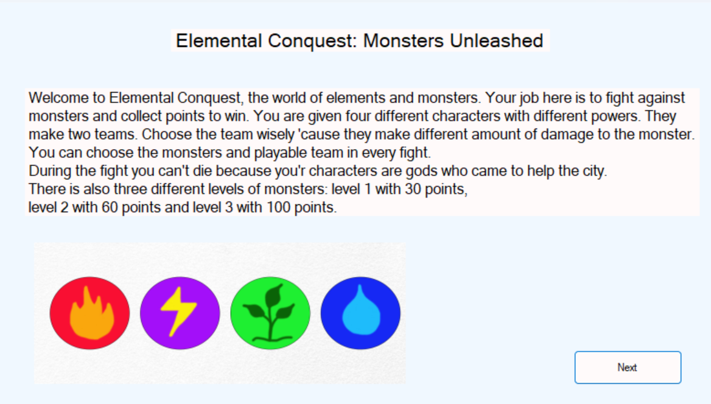
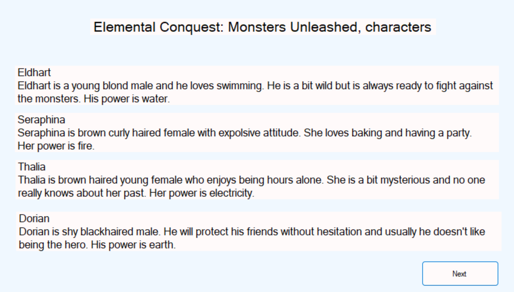
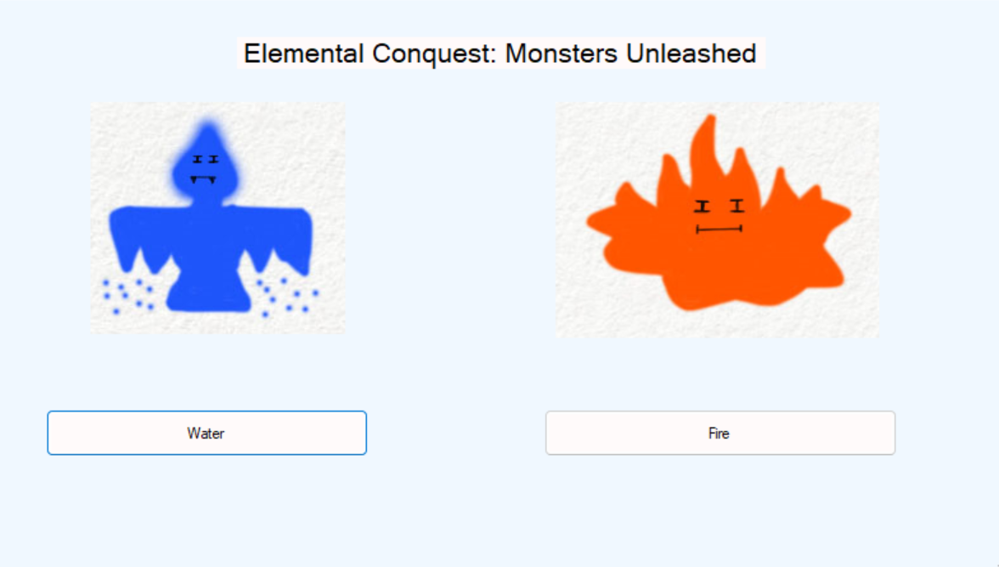
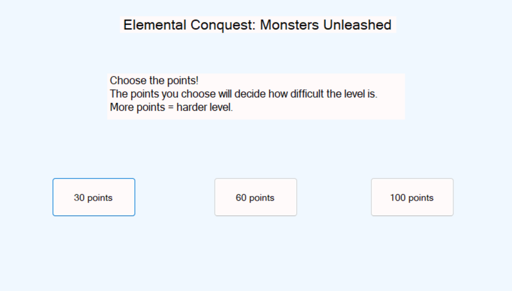
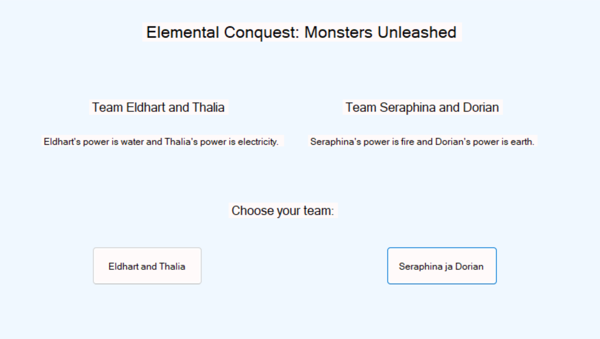
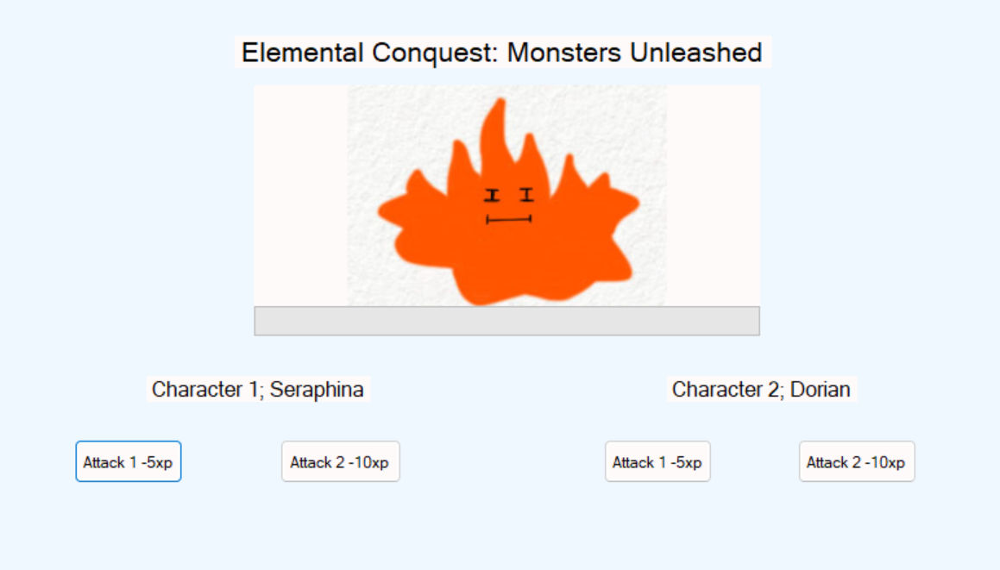
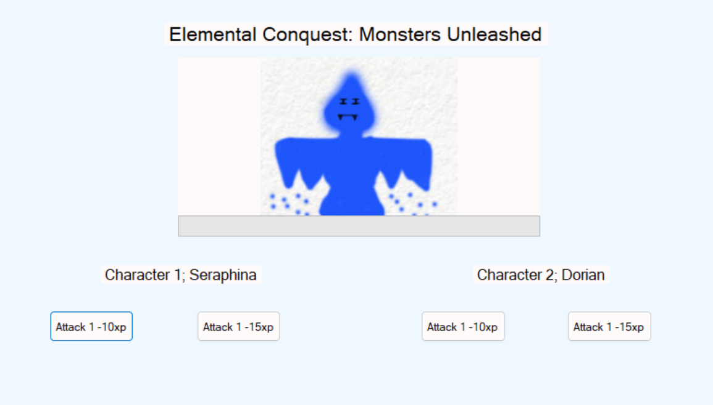
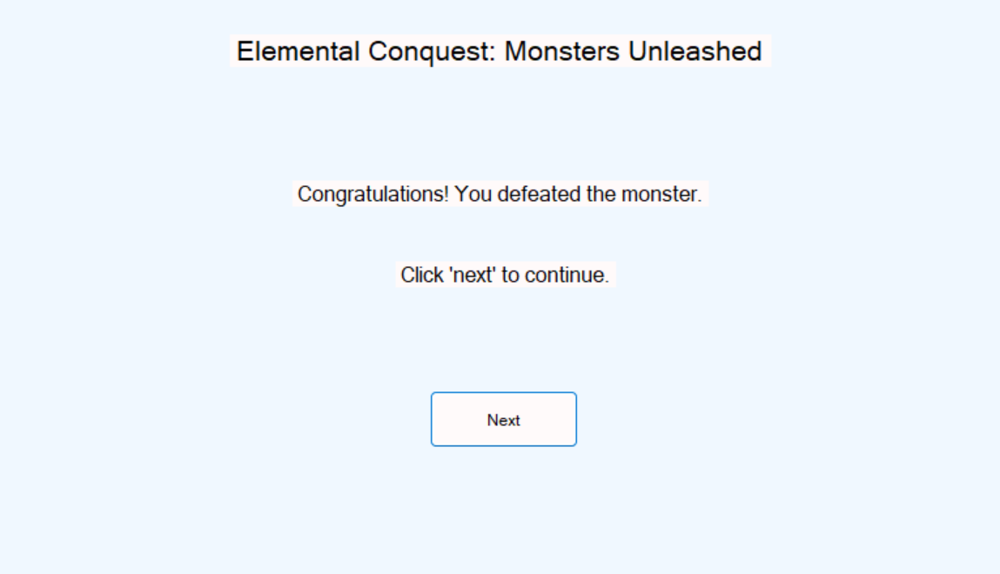
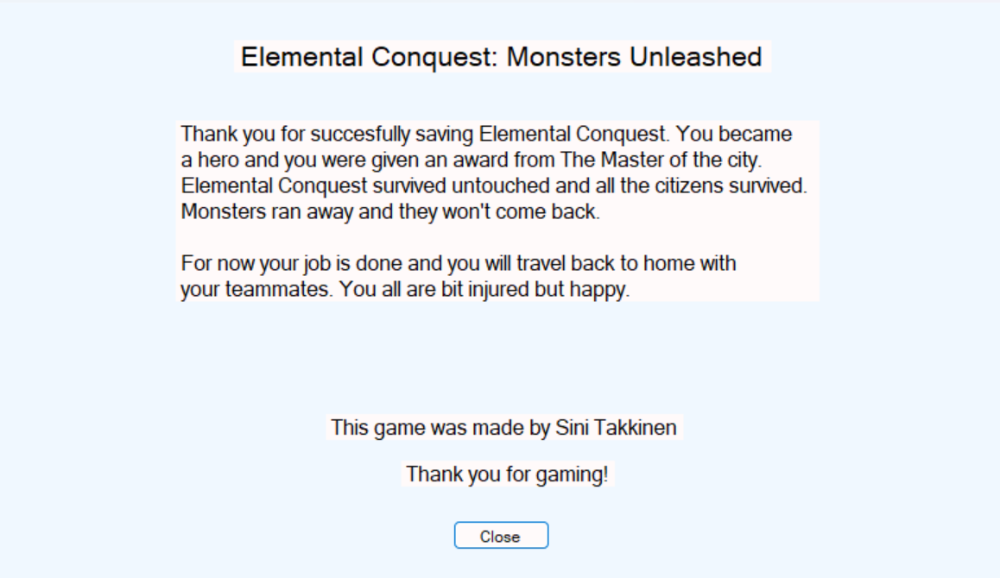
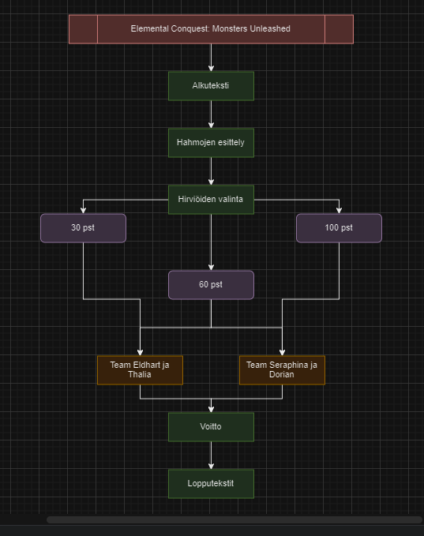

<h1>Elemental Conquest: Monsters Unleashed</h1>

Elemental Conquest or ECMU is very simple fighting game. The idea is to defeat monsters and save the city.

Gameplay is very simple. You use your mouse to click buttons and that's it.

 

Here is the begin and bit info about the game.
 

Here is info about the characters.
 

Here you choose the monster you will be fighting with. Options are fire and water.
 

Here you choose the points for your monster. More points equals more difficulty.
 

Now you choose between two teams. Other one is better when fighting a spesific monster, but both will win.
 

Now you see boht fights. They are the same in every fight, only monsters health rises. You fight by clicking the buttons below the picture which causes damage to the monster and eventually you will win.
 

This image appears when you defeat the monster.
 

This is the final image. By clicking "Close", the game closes but you still have to stop it from running by pressing red button in Visual Studio.
 

Here is the flowchart
  

<h3>How can I improve my game?</h3>

I could add more functionality and visual elements. I could make the game more challenging and include more events. Additionally, I could make the game longer and more complex.

